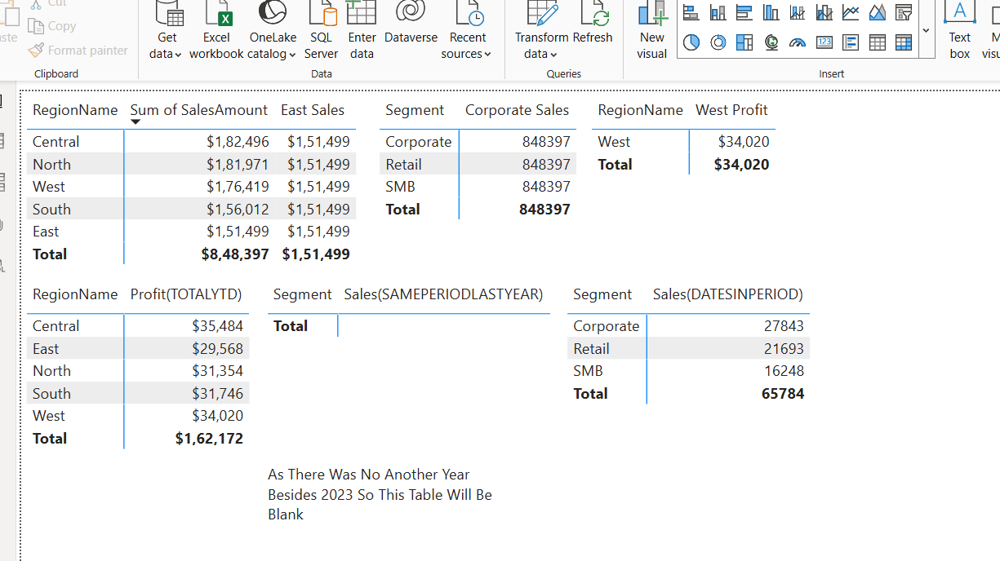

## 📸 Dashboard Preview

# 📊 DAX Depo Power BI Dashboard

Welcome to the **DAX Depo** project! This interactive Power BI dashboard is designed to turn raw data into actionable insights using the power of **DAX (Data Analysis Expressions)**. 💡

---

## 🚀 Project Overview

This Power BI report leverages DAX to model and visualize data for deeper analysis. The goal is to provide intuitive, filterable dashboards that help stakeholders make data-driven decisions faster and more effectively.

---

## 📂 Features

✨ Here's what you'll find in this report:

- 📈 **Interactive Charts** – Dynamic visuals that update based on slicer/filter selections  
- 🔢 **Calculated Columns & Measures** – Custom DAX logic for enhanced analysis  
- 📆 **Time Intelligence** – Smart comparisons like YTD, MTD, previous period, etc.  
- 📊 **KPI Dashboards** – Clear metrics to track performance at a glance  
- 🧭 **Navigation Pane** – Easy access to key report pages

---

## 🛠️ Technologies Used

- **Power BI Desktop** (.pbix)
- **DAX** – for measures, calculated columns, and advanced filtering
- **Power Query** – for data transformation and modeling

---

## 🧠 How to Use

1. **Open** the `.pbix` file in Power BI Desktop  
2. **Explore** the visuals – use slicers, filters, and drill-through features  
3. **Hover** over visuals for tooltips  
4. **Customize** as needed: add new visuals, adjust DAX formulas, or change the theme!  

---

## 📌 Tips for Users

🔍 Use the **slicers** to filter by category, region, time period, or other dimensions  
📆 Navigate to the **Time Intelligence** section to view YTD/QTD/MoM growth  
📁 Check the **Data Model** view for understanding relationships and tables  
🧮 Want to see how a measure is built? Open the **"Model"** tab and click on a measure!

---

## 🤝 Contributing

Want to improve the dashboard or add new data sources?  
Feel free to fork the file and collaborate! Suggestions are always welcome. 🌟

---

## 📬 Contact

Got feedback or questions about the dashboard or DAX logic?  
📧 Email: [your-email@example.com]  
🔗 LinkedIn: [Your LinkedIn]  
🐙 GitHub: [Your GitHub]

---

## 🎯 Final Notes

> “Without data, you’re just another person with an opinion.” — W. Edwards Deming

Dive into **DAX Depo**, explore trends, and let data drive your decisions! 📉📈📊
